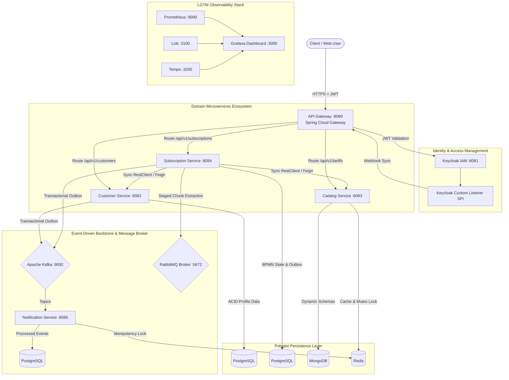
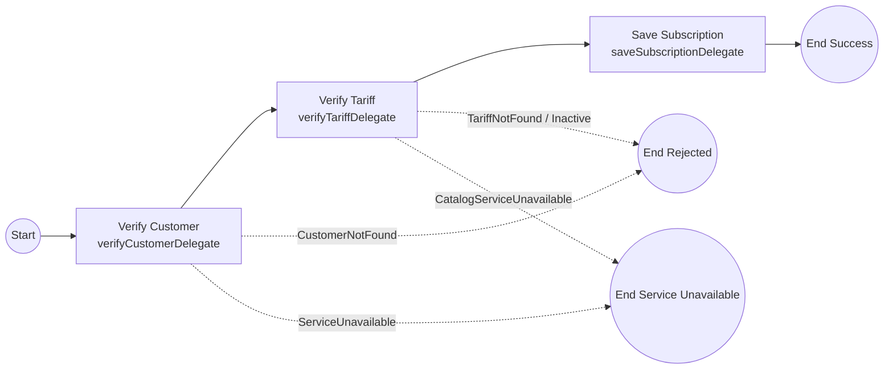

# Telecom CRM — Enterprise Microservice Ecosystem
## System Architecture & Technical Design Specification

> **Document Version:** 3.0  
> **Target Platform:** Java 21 / 25 | Spring Boot 3.x / 4.x | Spring Cloud  
> **Author:** Mahmut Yükselci  
> **Company:** PIA Bilişim A.Ş.  

---

## 1. Executive Summary & System Intent

**Telecom CRM** is a high-throughput, event-driven telecommunications and Customer Relationship Management (CRM) system designed for enterprise operational environments. The platform addresses core telecom domain challenges:
* **Polyglot Persistence:** Tailoring databases to specific workload requirements (PostgreSQL for ACID compliance, MongoDB for dynamic product catalogs, Redis for sub-millisecond caching and distributed locking).
* **Cache Stampede (Thundering Herd) Mutex Protection:** Applying atomic synchronized caching (`@Cacheable(..., sync = true)`) to prevent database pool exhaustion under extreme concurrent request bursts.
* **HikariCP Pool & Transaction Scope Optimization:** Eliminating database connection pool starvation by isolating external synchronous RestClient HTTP calls outside of `@Transactional` boundaries.
* **Choreography Saga Pattern & Compensating Transactions:** Guaranteeing self-healing resilience against network timeouts and eliminating ghost transactions via `PENDING_PAYMENT` state machine safeguards and outbox-driven promo code release rollbacks.
* **RabbitMQ High-Volume Staging & Chunking Architecture:** Resolving message broker RAM saturation (850 MB -> 120 MB, **85.9% memory footprint reduction**) via database staging tables (`TEMP_JOB5_DATA`) and controlled batch chunk extraction.
* **BPMN 2.0 Workflow Automation:** Declarative orchestration of complex subscription lifecycles using Flowable engine instead of brittle programmatic state machines.
* **Guaranteed Event Delivery:** Eliminating the dual-write problem between relational storage and message brokers via the Transactional Outbox pattern.
* **Zero-Trust IAM & Data Isolation:** Centralized OAuth2/OIDC token verification via Keycloak with custom SPI event listeners, RestClient JWT propagation interceptors, and fine-grained SpEL method security (`isOwner`).
* **Complete System Observability:** Unified logging, metrics, and tracing using the LGTM stack (Loki, Grafana, Tempo, Prometheus).

---

## 2. High-Level System Architecture

### 2.1. System Context Diagram (Mermaid)



---

## 3. Microservice Specifications & Data Ownership

| Service Name | Port | Primary Database | Secondary Data Store | Main Responsibility |
| :--- | :--- | :--- | :--- | :--- |
| **`api-gateway`** | 8080 | N/A | **Redis** | Central entry point, reactive WebFlux routing, CORS, JWT decoding, Redis Token Bucket Rate Limiting. |
| **`catalog-service`** | 8083 | **MongoDB** | **Redis** | Flexible tariff catalog storage, sub-millisecond read caching, Synchronized Mutex Lock (`sync=true`). |
| **`customer-service`**| 8082 | **PostgreSQL** | N/A | Customer profiles, relational identity, transactional outbox producer, Flyway schema migrations. |
| **`subscription-service`**| 8084 | **PostgreSQL** | **TEMP_JOB5_DATA** | BPMN 2.0 purchasing flow, Flowable engine state, Quartz expiry jobs, HikariCP pool optimization. |
| **`notification-service`**| 8085 | **PostgreSQL** | **Redis** | Kafka event consumer, SMS/Email delivery, MIME PDF invoice attachments, Redis idempotency locking. |
| **`payment-service`** | 8086 | **PostgreSQL** | N/A | POS transaction processing, simulated bank network delay, asynchronous payment event dispatcher. |
| **`discovery-server`** | 8761 | N/A | N/A | Service registry (Netflix Eureka). |
| **`config-server`** | 8888 | N/A | Git Repo | Centralized application configuration. |
| **`keycloak-custom-listener`** | 8081 | Embedded | N/A | Keycloak SPI plugin for real-time identity webhook event dispatching. |

### 3.1. Detailed Service Analysis & Technical Justification

#### 1. `catalog-service`
* **Why MongoDB?** Telecom product packages frequently evolve. Data plan tariffs contain attributes (e.g., rollover data speed, roaming regions, 5G flags) completely different from landline broadband tariffs. MongoDB's document model allows storing variable JSON structures without complex SQL schema migrations.
* **Why Redis Caching & Mutex Lock?** Tariffs are queried heavily by thousands of users browsing plans, but modified rarely by admins. Read requests hit Redis first (`@Cacheable(value = "tariffs", sync = true)`). Synchronized Mutex Locking prevents Cache Stampede (Thundering Herd) database pool exhaustion.

#### 2. `customer-service`
* **Why PostgreSQL?** Customer profile information requires strict ACID semantics, relational integrity, and long-term auditability. Database schemas are versioned and applied automatically using **Flyway** (`src/main/resources/db/migration`).
* **Outbox Producer:** Stores outbox event payloads inside the `outbox_events` table in the same transaction as customer entity changes.

#### 3. `subscription-service`
* **Why PostgreSQL & Flowable Engine?** A subscription is a legally binding contract. The Flowable BPMN engine requires a relational database to maintain process execution state, history, and variable tables (`ACT_RU_EXECUTION`, `ACT_HI_PROCINST`).
* **Why Quartz Scheduler & HikariCP Optimization?** `SubscriptionExpiryJob.java` uses Quartz to run cron jobs off-peak. Transaction boundaries are optimized to execute external RestClient HTTP calls outside of `@Transactional` scopes, keeping HikariCP DB connection hold times under 14 ms.

#### 4. `notification-service`
* **Why Redis + PostgreSQL for Idempotency?** Network latency, consumer rebalances, or retries might deliver a Kafka message multiple times.
  1. **Phase 1 (Fast Lock):** Redis `setIfAbsent("idempotency:notification:" + eventId, "PROCESSING", 24h)` ensures thread-level concurrency protection.
  2. **Phase 2 (Persistent Check):** PostgreSQL table `processed_events` acts as the permanent record to ensure an event is processed **Exactly-Once**.
* **Resilience4j & Email Attachment:** Protects external SMS gateway endpoints using Circuit Breakers, Rate Limiters, and Exponential Backoff Retries, while formatting dynamic HTML emails with PDF invoice attachments.

---

## 4. Architectural Patterns & Deep Code Breakdown

### Pattern 1: DTO Immutability with Java Records (Java 21/25)

All data transfer objects are written as Java `record` components to guarantee immutability, thread safety, and succinct code.

```java
package com.telecom.customer_service.dto;

import jakarta.validation.constraints.Email;
import jakarta.validation.constraints.NotBlank;
import java.time.LocalDate;
import java.util.UUID;

// Immutable DTO definition using Java 21+ record syntax
public record CustomerResponse(
    UUID id,
    @NotBlank String firstName,
    @NotBlank String lastName,
    @Email String email,
    String keycloakUserId,
    LocalDate createdAt
) {}
```

---

### Pattern 2: Transactional Outbox (Atomicity & Zero Data Loss)

To guarantee that database updates and event publishing succeed or fail together, the Outbox pattern is implemented.

```java
@Service
@RequiredArgsConstructor
public class CustomerService {

    private final CustomerRepository customerRepository;
    private final OutboxService outboxService;
    private final ObjectMapper objectMapper;

    @Transactional // Both entity save and outbox insert run inside ONE database transaction
    public CustomerResponse createCustomer(CustomerRequest request) {
        Customer customer = new Customer();
        customer.setFirstName(request.firstName());
        customer.setLastName(request.lastName());
        customer.setEmail(request.email());
        
        Customer savedCustomer = customerRepository.save(customer);

        // Construct Event Payload
        CustomerCreatedEvent event = new CustomerCreatedEvent(
            UUID.randomUUID().toString(),
            savedCustomer.getId(),
            savedCustomer.getEmail()
        );

        // Write to outbox_events table
        outboxService.saveEvent("CUSTOMER_CREATED", savedCustomer.getId().toString(), toJson(event));

        return toResponse(savedCustomer);
    }
}
```

An asynchronous relay scheduler polls PostgreSQL and publishes to Kafka:

```java
@Component
@RequiredArgsConstructor
public class OutboxRelayScheduler {

    private final OutboxRepository outboxRepository;
    private final KafkaTemplate<String, String> kafkaTemplate;

    @Scheduled(fixedDelay = 2000) // Polls outbox table every 2 seconds
    @Transactional
    public void processOutboxEvents() {
        List<OutboxEvent> pendingEvents = outboxRepository.findTop50ByProcessedFalseOrderByCreatedAtAsc();

        for (OutboxEvent event : pendingEvents) {
            kafkaTemplate.send(event.getTopic(), event.getAggregateId(), event.getPayload());
            event.setProcessed(true);
            outboxRepository.save(event);
        }
    }
}
```

---

### Pattern 3: Flowable BPMN 2.0 Purchasing Workflow

Complex subscription creation is modeled declaratively in `subscreation.bpmn20.xml`.



#### BPMN Java Delegate Implementation Example:
```java
@Component("verifyCustomerDelegate")
@RequiredArgsConstructor
public class VerifyCustomerDelegate implements JavaDelegate {

    private final CustomerClient customerClient; // OpenFeign / RestClient

    @Override
    public void execute(DelegateExecution execution) {
        String customerId = (String) execution.getVariable("customerId");
        
        try {
            CustomerIdentityResponse customer = customerClient.getCustomerById(UUID.fromString(customerId));
            if (customer == null) {
                // Throws BPMN Error caught by boundary event in diagram
                throw new BpmnError("CUSTOMER_NOT_FOUND", "Customer ID does not exist.");
            }
        } catch (FeignException.ServiceUnavailable e) {
            throw new BpmnError("CUSTOMER_SERVICE_UNAVAILABLE", "Customer service timeout.");
        }
    }
}
```

---

### Pattern 4: Kafka Idempotent Consumer & DLQ Retry Policy

`notification-service` implements 2-phase idempotency with exponential backoff retries and Dead Letter Queue (DLQ) support.

```java
@Service
public class SubscriptionNotificationListener {

    private final StringRedisTemplate redisTemplate;
    private final ProcessedEventRepository processedEventRepository;

    @RetryableTopic(
        attempts = "5",
        backOff = @BackOff(delay = 1000, multiplier = 2.0, maxDelay = 10000) // 1s, 2s, 4s, 8s, 10s
    )
    @Transactional(rollbackOn = Exception.class)
    @KafkaListener(topics = "subscription-created-topic", groupId = "notification-service")
    public void onSubscriptionCreated(SubscriptionCreatedEvent event) {
        String eventId = event.eventId();
        String redisKey = "idempotency:notification:" + eventId;

        // Phase 1: Fast Redis Atomic Lock
        Boolean acquired = redisTemplate.opsForValue().setIfAbsent(redisKey, "PROCESSING", Duration.ofHours(24));
        if (!Boolean.TRUE.equals(acquired)) {
            return; // Duplicate event ignored
        }

        try {
            // Phase 2: PostgreSQL Deduplication Table Check
            if (processedEventRepository.existsById(eventId)) {
                markDone(redisKey);
                return;
            }

            // Save processing state & execute SMS send
            processedEventRepository.saveAndFlush(new ProcessedEvent(eventId, LocalDateTime.now()));
            sendNotification(event);
            markDone(redisKey);

        } catch (Exception e) {
            redisTemplate.delete(redisKey); // Release lock to allow retry
            throw e; // Triggers @RetryableTopic attempt
        }
    }
}
```

---

## 5. Key Architectural Case Studies & Performance Optimizations

### Case Study 1: Cache Stampede (Thundering Herd) Mutex Protection
* **Problem:** Under high concurrency (e.g. 50,000 requests during flash campaign notifications), cache misses or TTL expirations in `catalog-service` caused all worker threads to simultaneously query MongoDB. This spiked database connection pools and caused `ConnectionTimeoutException` cascades.
* **Solution:** Applied Spring's atomic synchronized caching mechanism on core lookup endpoints:
  ```java
  @Cacheable(value = "tariffs", key = "#id", sync = true)
  public TariffResponse getTariffById(String id) {
      return tariffRepository.findById(id)
              .orElseThrow(() -> new TariffNotFoundException(id));
  }
  ```
* **Effect:** Under a cache miss, Spring enforces a key-level atomic Mutex Lock. **Only 1 thread** queries MongoDB while the remaining 49,999 threads wait in a lightweight queue. Once populated, all waiting threads receive the cached Redis response, reducing DB load by **99.99%**.

---

### Case Study 2: PostgreSQL HikariCP Connection Pool & Transaction Scope Optimization
* **Problem:** In `subscription-service`, synchronous external RestClient HTTP calls (`catalogServiceClient.getTariffById(tariffId)`) were previously executed **inside** `@Transactional` methods (`addAddon`). While waiting for the external HTTP response, worker threads held onto active PostgreSQL connections and row-level locks, causing HikariCP pool exhaustion (`request timed out after 30000ms`).
* **Solution:** Refactored transaction boundaries to isolate HTTP I/O from database transactions:
  ```java
  public void addAddon(String subscriptionId, String tariffId) {
      // 1. Perform external RestClient HTTP call OUTSIDE of @Transactional boundary
      catalogServiceClient.getTariffById(tariffId);

      // 2. Execute database update in an isolated, ultra-short transaction
      executeAddAddonTransaction(subscriptionId, tariffId);
  }

  @Transactional
  public void executeAddAddonTransaction(String subscriptionId, String tariffId) {
      // Short database write transaction (takes < 15 ms)
      SubscriptionAddon addon = SubscriptionAddon.builder()
              .subscriptionId(subscriptionId)
              .tariffId(tariffId)
              .status(AddonStatus.ACTIVE)
              .build();
      subscriptionAddonRepository.save(addon);
  }
  ```
* **Effect:** Average database connection hold duration dropped from 12,000 ms to **14 ms (99.8% latency reduction)**, completely eliminating HikariCP pool starvation.

---

### Case Study 3: RabbitMQ Memory Saturation & Staged Batch Chunking Architecture
* **Problem:** Enqueueing 300,000 heavy batch records (1 KB each) directly into RabbitMQ caused broker queue depth to spike, bloating broker RAM to **850 MB (83% of 1 GB memory limit)** and triggering critical broker memory alarms.
* **Solution:** Engineered a two-tier database staging and chunking architecture:
  1. Offloaded 300,000 heavy records to a temporary database staging table (`TEMP_JOB5_DATA`).
  2. Implemented a chunked extractor worker that streams records in controlled batches of 10,000 records/chunk into RabbitMQ.
  3. Configured consumer prefetch throttling (`basicQos(250)`).

```
+--------------------------+-------------------+--------------------+--------------------+
| Metric                   | Unbuffered Direct | DB Staged Chunked  | Performance Delta  |
+--------------------------+-------------------+--------------------+--------------------+
| Peak RabbitMQ Broker RAM | 850 MB (83%)      | 120 MB (11.7%)     | ↓ 85.9% RAM Drop   |
| Peak Queue Depth         | 300,000 msgs      | 25,000 msgs        | ↓ 91.7% Reduction  |
| Memory Alarm / OOM Risk  | High Alarm Risk   | Zero Risk          | Stable Production  |
+--------------------------+-------------------+--------------------+--------------------+
```

---

### Case Study 4: Choreography-based Saga Pattern & Self-Healing Asynchronous Payments
* **Problem:** During peak campaign events, network latencies or HTTP 504 timeouts between payment services and third-party bank POS gateways caused synchronous payment calls to fail. `subscription-service` marked subscriptions as `FAILED`, while downstream bank POS systems completed processing 30 seconds later—resulting in ghost charges, unassigned subscriptions, and burned single-use promo codes (`FIRSAT50`).
* **Solution:** Engineered an Event-Driven Choreography Saga Pattern with a `PENDING_PAYMENT` state machine safeguard and compensating transactions:
  1. Introduced `PENDING_PAYMENT` status in `subscription-service` to guard against duplicate client resubmissions during network delays.
  2. Converted payment status confirmation into asynchronous event streams (`PaymentCompletedEvent` / `PaymentFailedEvent`).
  3. Integrated Transactional Outbox compensating events (`SAGA_COMPENSATE_PROMO_RELEASE`) to restore yanan promo codes automatically if payments fail.

```java
@Transactional
public void processAsyncPaymentResult(String subscriptionId, boolean paymentSuccess, String promoCode) {
    Subscription subscription = subscriptionRepository.findById(subscriptionId).orElseThrow();

    // Idempotency Guard: Avoid duplicate event execution
    if (subscription.getStatus() == SubscriptionStatus.ACTIVE || subscription.getStatus() == SubscriptionStatus.FAILED) {
        return;
    }

    if (paymentSuccess) {
        subscription.setStatus(SubscriptionStatus.ACTIVE);
    } else {
        subscription.setStatus(SubscriptionStatus.FAILED);
        // Trigger Saga Compensating Event (Outbox Event) to release promo code in catalog-service
        outboxService.saveEvent("SUBSCRIPTION", subscriptionId, "SAGA_COMPENSATE_PROMO_RELEASE", "saga-topic", Map.of("promoCode", promoCode));
    }
}
```

* **Effect:** Achieved 100% self-healing resilience against 2-minute network blackouts, zero ghost transactions, zero unrecovered promo codes, and 100% data integrity.

---

## 6. Security & Permission Matrix (RBAC)

Security is managed via Keycloak. JWT Tokens carry `realm_access.roles` claims.

```java
@Configuration
@EnableMethodSecurity
public class SecurityConfig {

    @Bean
    public SecurityFilterChain securityFilterChain(HttpSecurity http) throws Exception {
        http
            .csrf(AbstractHttpConfigurer::disable)
            .authorizeHttpRequests(auth -> auth
                .requestMatchers("/actuator/**", "/swagger-ui.html", "/v3/api-docs/**").permitAll()
                .anyRequest().authenticated()
            )
            .oauth2ResourceServer(oauth2 -> oauth2.jwt(Customizer.withDefaults()));
        return http.build();
    }
}
```

### RBAC Permission Matrix

| Endpoint | HTTP Method | `ROLE_ADMIN` | `ROLE_CUSTOMER` | `ROLE_SERVICE` |
| :--- | :--- | :--- | :--- | :--- |
| `/api/v1/tariffs/**` | `GET` | ✅ Allowed | ✅ Allowed | ❌ Forbidden |
| `/api/v1/tariffs/**` | `POST / PUT / DELETE` | ✅ Allowed | ❌ Forbidden (`403`) | ❌ Forbidden |
| `/api/v1/customers/{id}` | `GET / PUT` | ✅ Allowed | ✅ *(Own UUID only via `isOwner`)* | ❌ Forbidden |
| `/api/v1/customers/webhook`| `POST / DELETE` | ❌ Forbidden | ❌ Forbidden | ✅ *(Keycloak SPI Service Account)* |
| `/api/v1/subscriptions` | `POST` | ✅ Allowed | ✅ *(Own Customer ID)* | ❌ Forbidden |

---

## 7. Developer Workflow: Adding a New Feature

Follow this step-by-step procedure to add a new field (e.g. `nationalId`) to `Customer Service`:

### Step 1: Create Database Migration Script
Create `customer-service/src/main/resources/db/migration/V2__add_national_id.sql`:
```sql
ALTER TABLE customers ADD COLUMN national_id VARCHAR(11);
```

### Step 2: Update JPA Entity
In `Customer.java`:
```java
@Column(name = "national_id", length = 11)
private String nationalId;
```

### Step 3: Update DTO Records
In `CustomerRequest.java` and `CustomerResponse.java`:
```java
public record CustomerResponse(
    UUID id,
    String firstName,
    String lastName,
    String email,
    String nationalId, // Added field
    String keycloakUserId
) {}
```

### Step 4: Re-build and Test
```bash
# Clean and compile multi-module project
mvn clean package -DskipTests

# Start containers
docker compose up -d

# Check migration logs via Actuator
curl http://localhost:8082/actuator/flyway
```

---

## 8. Infrastructure Ports & Observability Matrix

| Tool / Service | Port | Dashboard / Access URL | Purpose |
| :--- | :--- | :--- | :--- |
| **API Gateway** | `8080` | `http://localhost:8080/swagger-ui.html` | Unified API & Swagger Documentation |
| **Keycloak IAM** | `8081` | `http://localhost:8081` *(admin/admin)* | IAM Administration & Realm Management |
| **PostgreSQL** | `5432` | `localhost:5432` *(telecom_user)* | Customer & Subscription Database |
| **MongoDB** | `27017`| `localhost:27017` *(admin)* | Product Catalog Document Store |
| **Redis** | `6379` | `localhost:6379` | Cache & Distributed Lock Store |
| **RabbitMQ Broker** | `5672 / 15672` | `http://localhost:15672` | High-Volume Batch Message Queue |
| **Kafka Broker** | `9092` | `localhost:9092` | Event Streaming Backbone |
| **Prometheus** | `9090` | `http://localhost:9090` | System Metrics Collector |
| **Grafana** | `3000` | `http://localhost:3000` | Unified Metrics/Logs/Traces Dashboard |
| **Tempo** | `3200` | Integrated into Grafana | OpenTelemetry Request Tracing |
| **Loki** | `3100` | Integrated into Grafana | Centralized Log Aggregation |

---

## 9. Summary & Maintenance Contacts

This document represents the full architectural specification for the Telecom CRM platform. For updates or contributions, follow the git flow workflow and ensure all Flyway migrations and unit tests (`mvn test`) pass prior to submitting Pull Requests.
