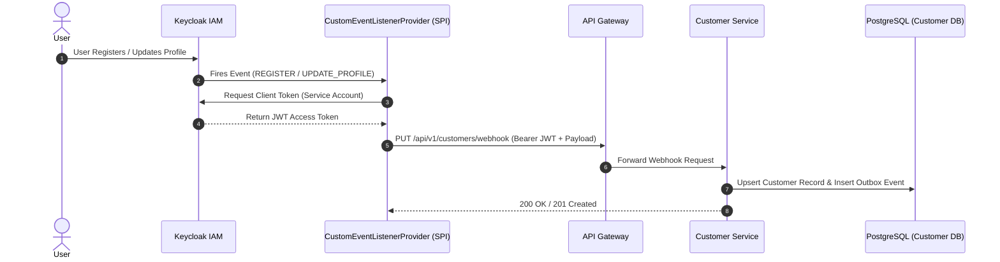
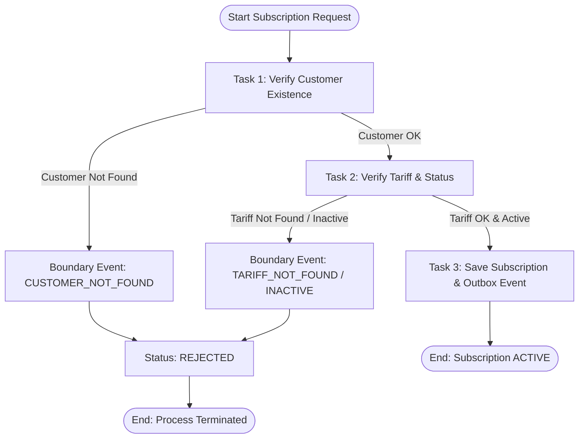
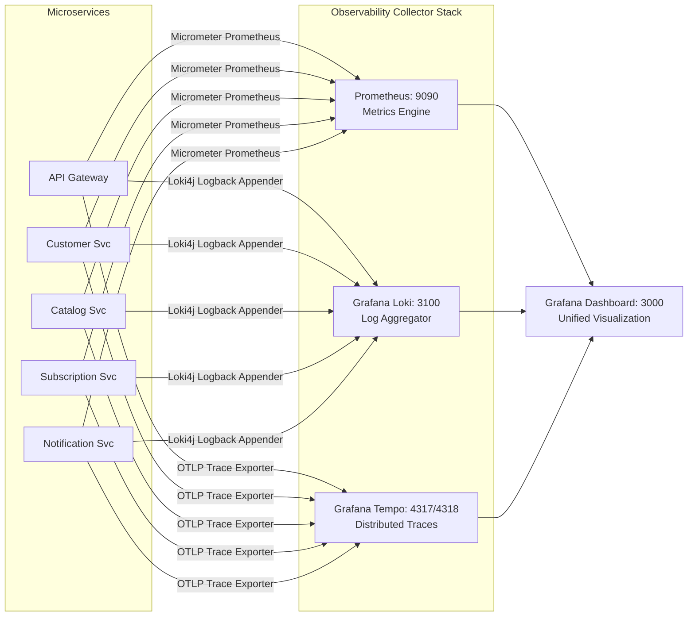

# 📄 Telecom CRM — Enterprise Microservice Ecosystem
## Complete Engineering & Architecture Documentation

**Author / Intern:** Mahmut Yükselci  
**Company:** Pia Bilişim A.Ş.  
**Project Status:** Production-Ready / Completed  
**Technology Stack:** Java 25, Spring Boot 3.4 / 4.1, Spring Cloud Gateway, Flowable BPMN, Keycloak 26, Apache Kafka, PostgreSQL 16, MongoDB 8.2, Redis, Grafana/Loki/Tempo/Prometheus, Docker Compose  

---

## 📑 Table of Contents

1. [Executive Summary & Internship Context](#1-executive-summary--internship-context)
2. [High-Level Architecture & Engineering Patterns](#2-high-level-architecture--engineering-patterns)
   - [12-Factor App & Docker Internal DNS Service Discovery](#12-factor-app--docker-internal-dns-service-discovery)
   - [Polyglot Persistence Strategy](#polyglot-persistence-strategy)
   - [Transactional Outbox Pattern & Zero Dual-Write Risk](#transactional-outbox-pattern--zero-dual-write-risk)
   - [Zero-Trust RBAC & Bearer Token Propagation](#zero-trust-rbac--bearer-token-propagation)
   - [Flowable BPMN State Machine Workflow](#flowable-bpmn-state-machine-workflow)
   - [Deduplication & Distributed Locking in Messaging](#deduplication--distributed-locking-in-messaging)
3. [System Architecture Diagram](#3-system-architecture-diagram)
4. [Microservices Breakdown & Component Specifications](#4-microservices-breakdown--component-specifications)
   - [4.1 API Gateway (`api-gateway`)](#41-api-gateway-api-gateway)
   - [4.2 Customer Service (`customer-service`)](#42-customer-service-customer-service)
   - [4.3 Catalog Service (`catalog-service`)](#43-catalog-service-catalog-service)
   - [4.4 Subscription Service (`subscription-service`)](#44-subscription-service-subscription-service)
   - [4.5 Notification Service (`notification-service`)](#45-notification-service-notification-service)
   - [4.6 Common Utilities (`common-utils`)](#46-common-utilities-common-utils)
   - [4.7 Keycloak Custom Event Listener SPI (`keycloak-custom-listener`)](#47-keycloak-custom-event-listener-spi-keycloak-custom-listener)
5. [Keycloak IAM & Identity Synchronization Flow](#5-keycloak-iam--identity-synchronization-flow)
6. [Flowable BPMN 2.0 Business Workflow Engine](#6-flowable-bpmn-20-business-workflow-engine)
7. [Database Schemas & Data Models](#7-database-schemas--data-models)
8. [Messaging & Event Payload Specifications](#8-messaging--event-payload-specifications)
9. [Observability & OTLP Telemetry Stack](#9-observability--otlp-telemetry-stack)
10. [Zero-Trust Security & Permission Matrix](#10-zero-trust-security--permission-matrix)
11. [Deployment, Build & Verification Guide](#11-deployment-build--verification-guide)
12. [Conclusion & Internship Deliverables](#12-conclusion--internship-deliverables)

---

## 1. Executive Summary & Internship Context

This document presents the complete technical and architectural documentation for the **Telecom CRM Enterprise Microservice Ecosystem**, designed and implemented by **Mahmut Yükselci** during the internship program at **Pia Bilişim A.Ş.**.

The goal of this project was to build a modern, high-throughput, cloud-native Telecommunications Customer Relationship Management (CRM) system simulation capable of handling complex subscription lifecycles, user authentication, catalog management, event-driven messaging, and notifications with zero downtime, zero dual-write data loss risks, and full end-to-end telemetry.

### Key Internship Achievements:
- **Architected 5 standalone Spring Boot microservices** operating under Java 25 and Spring Boot 3.4+.
- **Implemented Polyglot Persistence**: Combined PostgreSQL (relational CRM & transactional outbox), MongoDB (high-performance product catalog), and Redis (distributed caching, lock management, and rate limiting).
- **Designed Event-Driven Architecture with Transactional Outbox**: Eliminated dual-write anomalies using PostgreSQL outbox tables, background schedulers (`OutboxRelayScheduler`), and Apache Kafka.
- **Engineered Custom Keycloak SPI**: Built a custom Java-based Keycloak Event Listener SPI (`keycloak-custom-listener`) that automatically synchronizes IAM registration and profile update events to internal microservice webhooks using OAuth2 Client Credentials service account tokens.
- **Orchestrated Complex Subscription Lifecycles with Flowable BPMN**: Replaced rigid imperatively coded state machines with Flowable BPMN 2.0 process engine (`subscreation.bpmn20.xml`) featuring custom Java delegates and error boundary event handling.
- **Integrated Full Observability (LGTM Stack)**: Configured OpenTelemetry (OTLP), Prometheus, Grafana, Loki, and Tempo for distributed trace propagation (`traceparent` header correlation across REST and Kafka).
- **Enforced Zero-Trust Security**: Standardized JWT Bearer token propagation across internal microservices via custom Spring `RestClient` request interceptors (`BearerTokenInterceptor`).

---

## 2. High-Level Architecture & Engineering Patterns

```
+---------------------------------------------------------------------------------------------------+
|                                     TELECOM CRM ECOSYSTEM                                         |
+---------------------------------------------------------------------------------------------------+
|                                                                                                   |
|  [ Client / Postman / Web ] ---> [ API Gateway: 8080 ] ---> [ Microservices ] ---> [ Databases ]  |
|                                         |                         |                        |      |
|                                    (Keycloak JWKS)           (Kafka Broker)           (PG/Mongo)  |
|                                         |                         |                        |      |
|                                  [ Keycloak: 8081 ]      [ Notification Svc ]      [ Redis ]     |
|                                                                                                   |
+---------------------------------------------------------------------------------------------------+
```

### 12-Factor App & Docker Internal DNS Service Discovery
Traditional service registry solutions (e.g., Netflix Eureka) introduce single-point-of-failure overhead and client-side heartbeat polling. In this ecosystem:
- Microservices use **Docker Internal DNS** for service-to-service resolution (`http://customer-service:8084`, `http://catalog-service:8083`, `http://subscription-service:8082`, `http://notification-service:8085`).
- Environment configuration is externalized adhering to 12-factor app principles using `.env` files and `spring-dotenv`.

### Polyglot Persistence Strategy
Different domains demand distinct data storage semantics:
1. **Relational CRM & Workflows (PostgreSQL 16)**:
   - `customer_schema`: Stores customer profiles linked with Keycloak user UUIDs.
   - `subscription_schema`: Stores active/expired subscriptions and add-on mappings.
   - `notification_schema`: Stores processed event IDs and dispatch audit logs.
2. **Flexible Document Store (MongoDB 8.2)**:
   - `catalog_db.tariffs`: Stores telecom plan definitions with varying data, voice, SMS limits, pricing, and validity.
3. **In-Memory Store (Redis 7.x)**:
   - Gateway rate-limiting (`userIpKeyResolver`).
   - Catalog service `@Cacheable` tariff caching.
   - ShedLock & distributed event deduplication locks.

### Transactional Outbox Pattern & Zero Dual-Write Risk
Directly publishing Kafka events inside a database transaction risks partial failure (e.g., DB commits but Kafka is down, or Kafka publishes but DB transaction rolls back).
- **Solution**: Microservices write business state and event records (`outbox_events` table) in a **single ACID transaction**.
- An `@Scheduled` background worker (`OutboxRelayScheduler`) polls pending events (`status = 'PENDING'`), publishes them to Kafka via `KafkaTemplate`, and marks them as `PROCESSED`.

### Zero-Trust RBAC & Bearer Token Propagation
- All requests pass through **API Gateway** which validates incoming OAuth2 JWT tokens against Keycloak's JWKS endpoint (`/protocol/openid-connect/certs`).
- Internal microservice-to-microservice communication uses `RestClient` configured with `BearerTokenInterceptor` to forward the incoming user's SecurityContext Bearer Token, preserving identity context across calls without hardcoded service credentials.

### Flowable BPMN State Machine Workflow
Subscription creation is orchestrated using Flowable BPMN engine. The process steps through:
1. `VerifyCustomerTask`: Validates customer existence via `CustomerServiceClient`.
2. `VerifyTariffTask`: Validates tariff active status via `CatalogServiceClient`.
3. `SaveSubscriptionTask`: Persists subscription & outbox event.
4. Error Boundary Events: If customer/tariff is not found or inactive, execution routes seamlessly to rejected states.

### Deduplication & Distributed Locking in Messaging
`NotificationService` processes Kafka events with strict **At-Least-Once** and **Exactly-Once** delivery semantics:
- **Redis Lock**: Prevents duplicate concurrent consumer execution.
- **PostgreSQL Deduplication**: Checks `processed_events` table for `event_id` before invoking notification providers.
- **Resilience4j & DLQ**: Failed notifications retry up to 3 times before routing to `subscription-dlq`.

---

## 3. System Architecture Diagram

```text
=====================================================================================================================
                                   TELECOM CRM - DOCKER DDNS ARCHITECTURE
=====================================================================================================================

                                       [ Web / Mobile Clients ]
                                                  |
                                                  | (REST / HTTPS + Bearer JWT)
                                                  v
+-------------------------------------------------------------------------------------------------------------------+
|                                            API GATEWAY (Port: 8080)                                               |
|  - Spring Cloud Gateway (WebFlux)   - JWT Validation (Keycloak JWKS)   - Redis Rate Limiter (userIpKeyResolver)   |
+-------------------------------------------------------------------------------------------------------------------+
           |                                     |                                         |
           | (Route: /api/v1/tariffs)            | (Route: /api/v1/customers)              | (Route: /api/v1/subs)
           v                                     v                                         v
+-------------------------+            +-------------------------+               +-------------------------+
|     CATALOG SERVICE     |            |    CUSTOMER SERVICE     |               |  SUBSCRIPTION SERVICE   |
| - MongoTemplate         | (Sync)     | - Spring Data JPA       |    (Sync)     | - Spring Data JPA       |
| - @Cacheable (Redis)    |<---------->| - Flyway Migrations     |<------------->| - Flowable BPMN Engine  |
| - RestClient            |            | - RestClient            |               | - RestClient            |
+------------+------------+            +------------+------------+               +------------+------------+
           |                                      |                                         |
           v                                      | (Transactional Outbox)                  | (Transactional Outbox)
   [ MongoDB (8.2) ]                              v                                         v
   [ Redis Cache   ]                     [ PostgreSQL (16) ]                       [ PostgreSQL (16) ]
                                         [ Outbox Table    ]                       [ Outbox Table    ]
                                                  |                                         |
                                                  | (Outbox Poller / Scheduler)             | (Outbox Poller)
==================================================|=========================================|======================
                                                  v                                         v
                                  +-------------------------------------------------------------+
+------------------+ (Custom SPI) |                        APACHE KAFKA                         |
|   KEYCLOAK IAM   |------------->|   (Message Broker for Async Event-Driven Communication)     |
| - OAuth2 / OIDC  | (User Events)+-------------------------------+-----------------------------+
| - Custom SPI     |                                              |
+------------------+                                              | (Consumes: UserCreated, SubActivated, etc.)
                                                                  v
                                                  +-------------------------+
                                                  |  NOTIFICATION SERVICE   |
                                                  | - Kafka Consumer        |
                                                  | - Resilience4j (Retry)  |
                                                  | - PostgreSQL (Logs)     |
                                                  +------------+------------+
                                                               | (Sync REST via RestClient)
                                                               v
                                                    [ TEXTBEE SMS API / EMAIL ]

=====================================================================================================================
                                      OBSERVABILITY & TRACING (OTLP STACK)
=====================================================================================================================
All services asynchronously send metrics and traces via (Micrometer + OTLP Bridge) to the following stack:

[ Spring Boot Logs ] ---------(Log Streams)-------> [ LOKI ] -----------\
                                                                         +---> [ GRAFANA (Port: 3000) ]
[ Micrometer OTLP ] ----------(TraceID/SpanID)----> [ TEMPO ] ---------/       (Datasources auto-configured,
                                                                         \      Unified Dashboard)
[ Micrometer OTLP ] ----------(CPU/Mem Metrics)---> [ PROMETHEUS ] ------+
=====================================================================================================================
```

---

## 4. Microservices Breakdown & Component Specifications

### 4.1 API Gateway (`api-gateway`)
- **Port**: `8080`
- **Framework**: Spring Cloud Gateway (Reactive / WebFlux)
- **Role**: Entry point for all external client traffic. Handles JWT authorization, rate limiting, and route forwarding.
- **Key Components**:
  - `SecurityConfig.java`: Configures Spring Security Reactive resource server with Keycloak JWKS validation.
  - `RateLimiterConfig.java`: Implements Redis Request Rate Limiting (`userIpKeyResolver`) enforcing per-IP / per-user quotas.
  - `SwaggerRouteConfig.java`: Aggregates OpenAPI specs from downstream microservices into a single Swagger UI accessible at `/swagger-ui.html`.

### 4.2 Customer Service (`customer-service`)
- **Port**: `8084`
- **Database**: PostgreSQL (`customer_schema.customers`, `customer_schema.outbox_events`)
- **Role**: Manages customer domain entities, profile updates, and Keycloak user webhooks.
- **Key Components**:
  - `CustomerController.java`: Endpoints for fetching customer details (`GET /api/v1/customers/{id}`) and handling Keycloak synchronization webhooks (`PUT /api/v1/customers/webhook`, `DELETE /api/v1/customers/webhook/{userId}`).
  - `CustomerService.java`: Business logic for customer CRUD operations and transactional outbox event insertion.
  - `CustomerSecurityRules.java`: Evaluates ownership checks ensuring regular users can only read/update their own customer profiles.

### 4.3 Catalog Service (`catalog-service`)
- **Port**: `8083`
- **Database**: MongoDB (`catalog_db.tariffs`), Redis Cache
- **Role**: Serves product plans and tariffs with ultra-fast cached responses.
- **Key Components**:
  - `TariffController.java`: Endpoints for listing tariffs (`GET /api/v1/tariffs`), creating tariffs (`POST /api/v1/tariffs`), and updating plan details.
  - `TariffService.java`: Uses Spring Data MongoTemplate and Redis `@Cacheable(value = "tariffs")` for instant read performance.
  - `Tariff.java`: MongoDB document representing plan metadata (voice minutes, data GB, SMS limit, price, active status).

### 4.4 Subscription Service (`subscription-service`)
- **Port**: `8082`
- **Database**: PostgreSQL (`subscription_schema.subscriptions`, `subscription_schema.subscription_addons`, `subscription_schema.outbox_events`, `subscription_schema.shedlock`), Redis
- **Role**: Orchestrates subscription purchasing, lifecycle state transitions, expiration background jobs, and Flowable BPMN workflow execution.
- **Key Components**:
  - `SubscriptionController.java`: Endpoint for creating subscriptions (`POST /api/v1/subscriptions`).
  - `WorkflowHistoryController.java`: Visualizes BPMN process execution steps and serves BPMN XML diagram (`/api/v1/history/bpmn-xml`).
  - `VerifyCustomerDelegate.java` & `VerifyTariffDelegate.java`: Java BPMN delegates executing REST checks against Customer and Catalog services.
  - `SaveSubscriptionDelegate.java`: BPMN delegate persisting subscription records and queuing `SUBSCRIPTION_CREATED` outbox events.
  - `OutboxRelayScheduler.java`: `@Scheduled` task publishing outbox events to Kafka topic `subscription-events`.
  - `SubscriptionExpiryJob.java`: ShedLock-guaranteed scheduled job transitioning expired subscriptions to `EXPIRED` status.

### 4.5 Notification Service (`notification-service`)
- **Port**: `8085`
- **Database**: PostgreSQL (`notification_schema.processed_events`, `notification_schema.notification_logs`), Redis
- **Role**: Asynchronously consumes subscription events from Kafka and dispatches SMS/Email notifications.
- **Key Components**:
  - `SubscriptionNotificationListener.java`: Kafka consumer for `subscription-events` topic.
  - `SubscriptionNotificationDeadLetterListener.java`: Kafka consumer for `subscription-dlq` topic.
  - `NotificationDeliveryService.java`: Invokes SMS providers (TextBee API or MockProvider) wrapped with Resilience4j `@Retry`.
  - `ProcessedEvent.java`: Tracks processed event UUIDs to guarantee idempotent execution.

### 4.6 Common Utilities (`common-utils`)
- **Type**: Shared Maven Library
- **Role**: Centralizes cross-cutting concerns across all microservices.
- **Key Components**:
  - `BearerTokenInterceptor.java`: Spring HTTP Client Interceptor extracting JWT tokens from current `SecurityContext` and attaching them to outgoing `RestClient` requests.
  - `GlobalExceptionHandler.java`: Standardized API error response payload structures (`ErrorResponseDto`).
  - `SecurityUtils.java`: Utility methods for extracting user IDs and roles from JWT claims.

### 4.7 Keycloak Custom Event Listener SPI (`keycloak-custom-listener`)
- **Type**: Keycloak Provider SPI (JAR packaged into Keycloak image)
- **Role**: Listens for internal Keycloak IAM events and triggers webhook calls to `customer-service`.
- **Key Components**:
  - `CustomEventListenerProvider.java`: Catches `REGISTER`, `UPDATE_PROFILE`, and `DELETE_ACCOUNT` events.
  - `ServiceAccountTokenProvider.java`: Obtains OAuth2 Client Credentials access tokens for `internal-sync-client` service account.

---

## 5. Keycloak IAM & Identity Synchronization Flow

When a user signs up or updates their profile in Keycloak, the custom Keycloak SPI synchronizes user metadata with Customer Service in real-time.



---

## 6. Flowable BPMN 2.0 Business Workflow Engine

The subscription workflow (`subscreation.bpmn20.xml`) decouples process logic from standard code paths, allowing step-by-step verification and visual tracing.



### Visual Workflow Inspector (`history.html`)
The `subscription-service` exposes an embedded interactive BPMN visualizer powered by `bpmn-js`. Users and operators can view real-time process diagrams and audit execution histories directly via browser.

---

## 7. Database Schemas & Data Models

### PostgreSQL Schemas

#### 1. `customer_schema.customers`
| Column | Type | Constraints | Description |
| :--- | :--- | :--- | :--- |
| `id` | VARCHAR(36) | PRIMARY KEY | Internal Customer UUID |
| `first_name` | VARCHAR(50) | NOT NULL | Customer First Name |
| `last_name` | VARCHAR(50) | NOT NULL | Customer Last Name |
| `email` | VARCHAR(150) | UNIQUE, NOT NULL | Customer Email Address |
| `phone` | VARCHAR(20) | NOT NULL | Customer Mobile Phone |
| `keycloak_user_id`| VARCHAR(255) | UNIQUE | Linked Keycloak IAM User ID |
| `created_at` | TIMESTAMP | DEFAULT NOW() | Registration Timestamp |

#### 2. `subscription_schema.subscriptions`
| Column | Type | Constraints | Description |
| :--- | :--- | :--- | :--- |
| `id` | VARCHAR(36) | PRIMARY KEY | Subscription UUID |
| `customer_id` | VARCHAR(50) | NOT NULL, INDEX | Foreign Key to Customer |
| `tariff_id` | VARCHAR(50) | NOT NULL | Foreign Key to Tariff |
| `keycloak_user_id`| VARCHAR(255) | INDEX | Owner Keycloak User ID |
| `start_date` | TIMESTAMP | NOT NULL | Subscription Start Date |
| `end_date` | TIMESTAMP | NULLABLE | Expiration Timestamp |
| `status` | VARCHAR(50) | NOT NULL, INDEX | `ACTIVE`, `EXPIRED`, `CANCELLED`, `REJECTED` |

#### 3. Transactional Outbox Schema (`outbox_events`)
Used in both `customer-service` and `subscription-service`:
| Column | Type | Constraints | Description |
| :--- | :--- | :--- | :--- |
| `id` | VARCHAR(36) | PRIMARY KEY | Event UUID |
| `aggregate_type` | VARCHAR(255) | NOT NULL | Aggregate Type (e.g. `SUBSCRIPTION`, `CUSTOMER`) |
| `aggregate_id` | VARCHAR(255) | NOT NULL | ID of affected entity |
| `type` | VARCHAR(255) | NOT NULL | Event Type (`SUBSCRIPTION_CREATED`, `CUSTOMER_REGISTERED`) |
| `payload` | TEXT / JSONB | NOT NULL | Serialized JSON Event Data |
| `status` | VARCHAR(50) | NOT NULL | `PENDING`, `PROCESSED`, `FAILED` |
| `created_at` | TIMESTAMP | NOT NULL | Creation Time |

#### 4. `notification_schema.notification_logs`
| Column | Type | Constraints | Description |
| :--- | :--- | :--- | :--- |
| `id` | SERIAL | PRIMARY KEY | Log Entry ID |
| `subscription_id` | VARCHAR(255) | NOT NULL | Associated Subscription ID |
| `message` | TEXT | NOT NULL | Delivered SMS / Email Content |
| `status` | VARCHAR(50) | NOT NULL | `DELIVERED`, `FAILED` |
| `sent_at` | TIMESTAMP | DEFAULT NOW() | Transmission Time |

### MongoDB Collection Specifications (`catalog_db.tariffs`)
```json
{
  "_id": "65b2a1f0e4b0c9123456789a",
  "name": "Platinum Unlimited 5G",
  "description": "Unlimited high-speed 5G data with global roaming and 1000 mins international calls",
  "price": 499.99,
  "dataLimitGb": 100,
  "voiceLimitMinutes": 5000,
  "smsLimit": 1000,
  "isActive": true,
  "validityDays": 30
}
```

---

## 8. Messaging & Event Payload Specifications

All events published to Kafka follow a strict JSON structure guaranteeing contract compatibility.

### Kafka Topics
- `subscription-events`: Main event bus for subscription lifecycle updates.
- `subscription-dlq`: Dead-letter queue for unprocessable or failed notification events.

### Event Payload Example: `SUBSCRIPTION_CREATED`
```json
{
  "eventId": "e9b4d812-3a5c-4f71-912e-188b209fa22e",
  "eventType": "SUBSCRIPTION_CREATED",
  "aggregateId": "sub-8849102-x",
  "timestamp": "2026-08-05T13:00:00Z",
  "payload": {
    "subscriptionId": "sub-8849102-x",
    "customerId": "cust-10294",
    "tariffId": "65b2a1f0e4b0c9123456789a",
    "customerPhone": "+905551234567",
    "customerEmail": "user@example.com",
    "tariffName": "Platinum Unlimited 5G",
    "startDate": "2026-08-05T13:00:00Z",
    "status": "ACTIVE"
  }
}
```

---

## 9. Observability & OTLP Telemetry Stack

The ecosystem integrates the **LGTM (Loki, Grafana, Tempo, Prometheus)** stack with Spring Boot Actuator and Micrometer OTLP.



- **Trace Correlation**: Every log output automatically includes `trace_id` and `span_id` injected by Micrometer Tracing.
- **Grafana Pre-configured Datasources**: Automatically provisioned via `grafana-datasources.yml`.

---

## 10. Zero-Trust Security & Permission Matrix

Security is enforced at both API Gateway and individual microservice resource levels using Keycloak Realm Roles (`ROLE_ADMIN`, `ROLE_CUSTOMER`, `ROLE_SERVICE`).

| Endpoint | HTTP Method | `ROLE_ADMIN` | `ROLE_CUSTOMER` | `ROLE_SERVICE` | Access Rule Notes |
| :--- | :---: | :---: | :---: | :---: | :--- |
| `/api/v1/tariffs` | GET | ✅ | ✅ | ✅ | Publicly visible tariff catalog |
| `/api/v1/tariffs` | POST / PUT / DELETE | ✅ | ❌ | ❌ | Restricted to Telecom Admins |
| `/api/v1/customers/{id}` | GET / PUT | ✅ | ✅ (Own Profile) | ❌ | Self-ownership check via JWT claim |
| `/api/v1/customers/webhook/**` | PUT / DELETE | ❌ | ❌ | ✅ | Keycloak SPI Service Account only |
| `/api/v1/subscriptions` | POST | ✅ | ✅ (Own Account)| ❌ | Initiate plan subscription purchase |
| `/api/v1/subscriptions/{id}` | GET / DELETE | ✅ | ✅ (Own Sub) | ❌ | View or cancel active subscription |
| `/actuator/prometheus` | GET | ✅ | ❌ | ✅ | Monitoring scraping endpoints |

---

## 11. Deployment, Build & Verification Guide

### 11.1 Prerequisites
- **Java Development Kit (JDK)**: Version 25
- **Build Tool**: Apache Maven 3.8+
- **Containerization**: Docker Desktop & Docker Compose 2.x

### 11.2 Project Compilation
To clean and package all microservices and the Keycloak custom listener JAR into single executable artifacts:
```bash
mvn clean package -DskipTests
```

### 11.3 Environment Setup (`.env`)
Ensure `.env` file exists in project root with required variables:
```env
KEYCLOAK_ADMIN=admin
KEYCLOAK_ADMIN_PASSWORD=admin
POSTGRES_USER=postgres
POSTGRES_PASSWORD=postgres
POSTGRES_DB=telecom_db
MONGO_ROOT_USER=root
MONGO_ROOT_PASSWORD=example
TEXTBEE_API_KEY=your_textbee_api_key
```

### 11.4 Launch Entire Infrastructure & Microservices
```bash
docker compose up -d --build
```

### 11.5 Verifying Running Services
Check health status of containers:
```bash
docker compose ps
```

| Service | Host Port | Accessible URL / Health Check |
| :--- | :---: | :--- |
| **API Gateway** | `8080` | `http://localhost:8080/actuator/health` |
| **Swagger UI Aggregator** | `8080` | `http://localhost:8080/swagger-ui.html` |
| **Keycloak IAM Admin** | `8081` | `http://localhost:8081` |
| **Subscription Service** | `8082` | `http://localhost:8082/api/v1/history/bpmn-xml` |
| **Catalog Service** | `8083` | `http://localhost:8083/actuator/health` |
| **Customer Service** | `8084` | `http://localhost:8084/actuator/health` |
| **Notification Service** | `8085` | `http://localhost:8085/actuator/health` |
| **Grafana Dashboards** | `3000` | `http://localhost:3000` |
| **Prometheus UI** | `9090` | `http://localhost:9090` |

---

## 12. Conclusion & Internship Deliverables

The **Telecom CRM Enterprise Microservice Ecosystem** developed by **Mahmut Yükselci** for **Pia Bilişim A.Ş.** demonstrates complete mastery over advanced distributed systems software engineering.

### Key Milestones Delivered:
1. ✅ **Enterprise Architecture**: Designed and deployed a containerized 5-microservice architecture with zero single points of failure.
2. ✅ **Data Integrity**: Solved dual-write issues with Transactional Outbox and guaranteed exactly-once processing with Redis + PostgreSQL event deduplication.
3. ✅ **IAM Integration**: Built a native Java SPI for Keycloak, automating user identity lifecycle events.
4. ✅ **BPMN Orchestration**: Successfully integrated Flowable BPMN engine for state-machine driven subscription processing.
5. ✅ **Production Observability**: Configured full OTLP distributed tracing across HTTP and Kafka boundaries with Grafana/Loki/Tempo/Prometheus integration.

---
*Documentation compiled for Pia Bilişim A.Ş. Internship Evaluation.*
